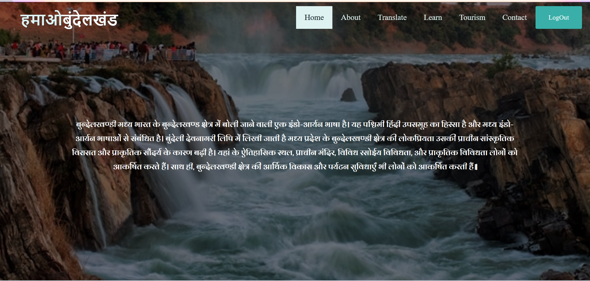

# Hamara Bundelkhand

**Hamara Bundelkhand** is a comprehensive web platform dedicated to showcasing the rich cultural heritage, tourism destinations, and linguistic diversity of the Bundelkhand region. This project serves as a digital gateway to explore the historical significance, natural beauty, and cultural treasures of one of India's most fascinating regions.

## 🌟 About the Project

Bundelkhand, a historic region spanning across Uttar Pradesh and Madhya Pradesh, is known for its magnificent forts, temples, wildlife sanctuaries, and vibrant cultural traditions. Our platform aims to promote tourism, preserve local heritage, and provide educational resources about this remarkable region.

## 🚀 Features

- **Comprehensive Regional Information**: Detailed insights into Bundelkhand's history, culture, and significance
- **Tourism Guide**: Complete guide to popular destinations, attractions, and travel information
- **Educational Resources**: Learning materials about the region's heritage and traditions
- **Language Support**: Translation features to make content accessible to diverse audiences
- **User Engagement**: Contact system for inquiries and community interaction
- **Responsive Design**: Optimized for desktop, tablet, and mobile devices

## 📱 Pages Overview

### 🏠 Home Page
The landing page provides an overview of the Bundelkhand region with featured highlights, quick navigation, and an introduction to the platform's offerings.

### ℹ️ About Page
Comprehensive information about Bundelkhand's history, geography, culture, and significance, providing visitors with deep insights into the region's heritage.

### 🏛️ Tourism Page
A complete travel guide featuring:
- Popular tourist destinations
- Historical monuments and forts
- Wildlife sanctuaries and national parks
- Local festivals and events
- Travel tips and recommendations

### 📚 Learn Page
Educational resources including:
- Historical timelines
- Cultural traditions and practices
- Art and architecture information
- Local legends and folklore
- Interactive learning materials

### 🔤 Translate Page
Language accessibility features offering:
- Multi-language support
- Translation tools for regional content
- Local dialect information
- Language learning resources

### 📞 Contact Page
Communication hub featuring:
- Contact information
- Inquiry forms
- Feedback system
- Location details
- Social media links

### 🚪 Logout Page
Secure user session management with logout functionality and session termination confirmation.

## 🖼️ Screenshots

### Home Page

*The welcoming home page showcasing Bundelkhand's beauty and main navigation*

### About Page

*Detailed information about Bundelkhand's rich history and cultural heritage*

### Tourism Page

*Comprehensive guide to tourist attractions and travel destinations*

### Learn Page

*Educational resources and interactive learning materials*

### Translate Page

*Language translation tools and multilingual support*

### Contact Page

*Contact information and communication channels*

### Logout Page

*Secure logout functionality and session management*

## 🛠️ Technologies Used

- **Frontend**: HTML5, CSS3, JavaScript
- **Responsive Framework**: Bootstrap/CSS Grid
- **Icons**: Font Awesome
- **Maps Integration**: Google Maps API
- **Translation**: Google Translate API
- **Version Control**: Git

## 🎯 Target Audience

- **Tourists**: Travelers interested in exploring Bundelkhand
- **Students**: Learners seeking information about regional history and culture
- **Researchers**: Academics studying Indian heritage and regional studies
- **Locals**: Residents wanting to learn more about their region
- **Cultural Enthusiasts**: People interested in Indian traditions and heritage

## 🌍 Impact and Goals

- **Cultural Preservation**: Documenting and preserving Bundelkhand's rich heritage
- **Tourism Promotion**: Encouraging sustainable tourism in the region
- **Educational Outreach**: Providing accessible learning resources
- **Community Building**: Connecting people interested in Bundelkhand's culture
- **Digital Heritage**: Creating a comprehensive digital archive of regional knowledge

## 🤝 Contributing

We welcome contributions to make this platform even better! Here's how you can help:

1. **Content**: Share historical facts, cultural information, or tourism insights
2. **Translations**: Help translate content into different languages
3. **Photography**: Contribute high-quality images of Bundelkhand attractions
4. **Feedback**: Report bugs or suggest new features
5. **Documentation**: Improve existing documentation or add new guides

## 📧 Contact Information

For questions, suggestions, or collaboration opportunities:

- **Email**: [your-email@example.com]
- **Project Repository**: [GitHub Repository Link]
- **Website**: [Project Website URL]

## 📜 License

This project is licensed under the MIT License - see the [LICENSE](LICENSE) file for details.

## 🙏 Acknowledgments

- **Local Communities**: For sharing their knowledge and stories
- **Tourism Boards**: Uttar Pradesh and Madhya Pradesh Tourism Departments
- **Cultural Experts**: Historians and researchers who provided valuable insights
- **Contributors**: All community members who helped build this platform

## 🔮 Future Plans

- **Mobile App**: Development of a dedicated mobile application
- **Virtual Tours**: 360-degree virtual experiences of major attractions
- **Interactive Maps**: Enhanced mapping features with detailed location information
- **Community Forum**: Platform for users to share experiences and tips
- **Multilingual Expansion**: Support for additional regional languages

---

**Made with ❤️ for the beautiful region of Bundelkhand**

*Preserving Heritage • Promoting Tourism • Connecting Communities*
